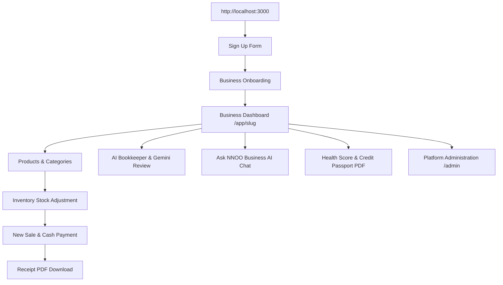

# 🎈 The Complete Step-by-Step Guide to Configuring & Testing NNOO Web Locally
### *(Written for Complete Novices with Zero Technical Background — 100% Accurate to the Codebase)*

---

## 🌟 The Big Picture: How NNOO Works (In Plain English)

Think of NNOO like opening a modern, high-tech retail business:

1. **The Storefront (Your Web Browser at `http://localhost:3000`):** The actual website where you click buttons, view products, ring up sales, and look at financial reports.
2. **The Cloud Filing Cabinet (Supabase PostgreSQL Database):** A secure database server in the cloud where every user account, business workspace, product, inventory count, invoice, and receipt is permanently saved.
3. **The Smart Assistant (Google Gemini AI):** A fast AI engine that reads plain-English expense notes, automatically categorizes them for your accounting books, and answers questions about your business in real time.
4. **The Card Machine in Test Mode (Paystack):** A payment gateway running in Sandbox/Test mode with **fake play money** so you can test subscription plans without spending any real money.

To make all four pieces talk to each other on your computer, they need a small list of passwords and addresses called **Environment Variables**. These are stored in a single text file named `.env.local` inside the `apps/web` folder.

---

## 🧭 Master Configuration Checklist (What is Needed)

| What is Needed | Where It Goes in `.env.local` | Is It Already Provided in Your File? | Direct Website Link to Get It |
| :--- | :--- | :--- | :--- |
| **Node.js (v20+) & pnpm** | Installed on Windows | ⚠️ Needs to be installed on your computer | [https://nodejs.org](https://nodejs.org) |
| **Supabase URL & Keys** | `NEXT_PUBLIC_SUPABASE_URL`<br>`NEXT_PUBLIC_SUPABASE_ANON_KEY`<br>`SUPABASE_SERVICE_ROLE_KEY` | ✅ **Already 100% plugged in for project `hoorlxgtnamwdxszsbwt`!** | [https://supabase.com](https://supabase.com) |
| **Supabase Auth Redirect URL** | Configured in Supabase Dashboard | ⚠️ One-time 30-second toggle in Supabase | [https://supabase.com/dashboard/project/hoorlxgtnamwdxszsbwt/auth/url-configuration](https://supabase.com/dashboard/project/hoorlxgtnamwdxszsbwt/auth/url-configuration) |
| **Google Gemini API Key** | `GEMINI_API_KEY` | ✅ **Already 100% plugged in!** | [https://aistudio.google.com/app/apikey](https://aistudio.google.com/app/apikey) |
| **Paystack Test Keys** | `PAYSTACK_SECRET_KEY`<br>`NEXT_PUBLIC_PAYSTACK_PUBLIC_KEY` | 🟡 Currently has placeholder `sk_test_123` | [https://dashboard.paystack.com/signup](https://dashboard.paystack.com/signup) |

---

## 🛠️ Step 1: Install the 2 Required Software Tools on Your PC

You only need to do this once on your computer:

### 1. Node.js (The JavaScript Engine)
- **What it is:** The program that executes website code on your machine.
- **Download Link:** Go to **[https://nodejs.org](https://nodejs.org)**
- **What to click:** Download the big green button labeled **"LTS (Recommended for Most Users)"**.
- **Installation:** Open the downloaded `.msi` file, click **Next**, accept the license terms, keep all defaults, and click **Finish**.
- **Verification:**
  1. Press the **Windows Key** on your keyboard, type **PowerShell**, and press **Enter**.
  2. Type:
     ```powershell
     node -v
     ```
  3. You should see a version number like `v22.x.x` or `v24.x.x`.

### 2. pnpm (The Package Manager)
- **What it is:** The tool that downloads and links all libraries for NNOO.
- **Installation:** In that same PowerShell window, run:
  ```powershell
  npm install -g pnpm
  ```
- **Verification:** Run:
  ```powershell
  pnpm -v
  ```
  You should see a version number (like `10.x.x` or `9.x.x` or `11.x.x`).

---

## ⚙️ Step 2: Supabase One-Time Configuration (Crucial for Smooth Login!)

Your database is already created and connected (Project ID: `hoorlxgtnamwdxszsbwt`, Name: **NNOO Bus Project**). To make sure testing is seamless and you don't get stuck on email verification:

### 1. Set the Local Redirect URL
1. Open your browser and go to your Supabase Project:  
   👉 **[https://supabase.com/dashboard/project/hoorlxgtnamwdxszsbwt](https://supabase.com/dashboard/project/hoorlxgtnamwdxszsbwt)**
2. In the left-hand dark menu, click on the **Authentication icon (the person 👤)**.
3. Click on **"URL Configuration"** in the sub-menu.
4. Check these two fields:
   - **Site URL:** Set to `http://localhost:3000`
   - **Redirect URLs:** Click **"Add URL"** $\to$ type `http://localhost:3000/**` $\to$ click **Save**.
   *(This tells Supabase: "When anyone logs in or clicks an auth link, always send them back to my local website!").*

### 2. (Optional but Highly Recommended for Testing) Turn Off Email Confirmation
If you want to test signing up instantly with any test email (like `test@mybusiness.com`) without having to open an email inbox:
1. In the same **Authentication** section, click **"Providers"**.
2. Click on **"Email"** to expand the email settings.
3. Uncheck **"Confirm email"** (toggle it OFF).
4. Click **"Save"**.
*(Now whenever you sign up on `http://localhost:3000/sign-up`, you are instantly logged in and go straight to onboarding!)*

> [!TIP]
> **Want Real Verification Emails with Instant 6-Digit Codes?**
> If you want real emails delivered to your inbox without hitting Supabase's strict 3-emails/hour limit, connect **Resend Custom SMTP**! Follow our dedicated [Complete Beginner's Resend Setup Guide](file:///c:/Users/H-P/Desktop/nnoo/docs/guides/RESEND_EMAIL_SETUP_GUIDE.md).

---

## 💳 Step 3: Get Your Free Paystack Test Keys (Only Needed for Billing)

If you plan to test subscription upgrades (`Settings -> Billing`), you need free test keys:

1. **Sign Up / Sign In:** Go to **[https://dashboard.paystack.com/signup](https://dashboard.paystack.com/signup)**
2. **Ensure Test Mode is Active:** Look at the top navigation bar. Make sure the toggle says **"Test Mode"** (with an orange badge). **Never use Live Mode for testing.**
3. **Copy the Keys:**
   - In the left sidebar, click **"Settings ⚙️"** (at the bottom).
   - Along the top tabs, click **"API Keys & Webhooks"**.
   - You will see:
     * **Test Secret Key:** Starts with `sk_test_...` $\to$ Click the copy icon.
     * **Test Public Key:** Starts with `pk_test_...` $\to$ Click the copy icon.

---

## 🤖 Step 4: Verify Your Google Gemini AI Key

1. **Your key is already active** in [`apps/web/.env.local`](file:///c:/Users/H-P/Desktop/nnoo/apps/web/.env.local)!
2. If you ever want your own personal backup key:
   - Go to: **[https://aistudio.google.com/app/apikey](https://aistudio.google.com/app/apikey)**
   - Sign in with your Google account.
   - Click **"Create API Key"** $\to$ choose **"Create API key in new project"**.
   - Copy the key starting with `AIzaSy...`.

---

## 📄 Step 5: Exact Content of Your `apps/web/.env.local` File

Open the configuration file in your editor:  
[`c:\Users\H-P\Desktop\nnoo\apps\web\.env.local`](file:///c:/Users/H-P/Desktop/nnoo/apps/web/.env.local)

Make sure it matches this exact format line-for-line:

```env
# ==============================================================================
# NNOO — Africa's AI Business Operating System
# Local Web Development Environment Configuration (apps/web/.env.local)
# ==============================================================================

# ------------------------------------------------------------------------------
# 1. Environment & Site Origin
# ------------------------------------------------------------------------------
NNOO_ENV="development"
NODE_ENV="development"
NEXT_PUBLIC_SITE_URL="http://localhost:3000"

# ------------------------------------------------------------------------------
# 2. Supabase Backend (Canonical NNOO Bus Project: hoorlxgtnamwdxszsbwt)
# ------------------------------------------------------------------------------
NEXT_PUBLIC_SUPABASE_URL="https://hoorlxgtnamwdxszsbwt.supabase.co"
NEXT_PUBLIC_SUPABASE_ANON_KEY="your_supabase_anon_public_key_here"
SUPABASE_SERVICE_ROLE_KEY="your_supabase_service_role_secret_key_here"

# ------------------------------------------------------------------------------
# 3. Paystack SaaS Subscription Billing (Test Sandbox Mode)
# ------------------------------------------------------------------------------
# Replace with your real test keys from Step 3 if testing billing checkouts:
PAYSTACK_SECRET_KEY="sk_test_paste_your_real_paystack_secret_key_here"
NEXT_PUBLIC_PAYSTACK_PUBLIC_KEY="pk_test_paste_your_real_paystack_public_key_here"
PAYSTACK_ENVIRONMENT="test"

# ------------------------------------------------------------------------------
# 4. Google Gemini AI Engine (Bookkeeper, Ask NNOO, Insights)
# ------------------------------------------------------------------------------
GEMINI_API_KEY="your_gemini_api_key_here"
GEMINI_MODEL_DEFAULT="gemini-3.6-flash"
AI_ENABLED="true"
AI_TIMEOUT_MS="15000"
AI_MAX_RETRIES="2"

# ------------------------------------------------------------------------------
# 5. Meta WhatsApp Business Cloud API (Keep Disabled for Local Testing)
# ------------------------------------------------------------------------------
WHATSAPP_ENABLED="false"
WHATSAPP_PROVIDER="meta_cloud_api"
WHATSAPP_GRAPH_API_VERSION="v20.0"
WHATSAPP_PEPPER="nnoo-default-whatsapp-pepper-salt-2026"

# ------------------------------------------------------------------------------
# 6. Inngest Durable Job Foundation
# ------------------------------------------------------------------------------
INNGEST_APP_ID="nnoo-web"
```

Save the file (**Ctrl + S**).

---

## 🚀 Step 6: How to Launch the Local Web App (2 Easy Commands)

### 1. Open PowerShell / Command Prompt
Make sure you are in the root project folder:
```powershell
cd c:\Users\H-P\Desktop\nnoo
```

### 2. Install Dependencies (Fast check)
```powershell
pnpm install
```
*(This makes sure all modules and packages are in place).*

### 3. Start the Next.js Web Server
```powershell
pnpm run dev:web
```

### 4. What Success Looks Like in the Terminal
You will see output like this:
```text
▲ Next.js 16.3.0 (Turbopack)
- Local:        http://localhost:3000
- Environments: .env.local

✓ Ready in 1.2s
```

### 5. Open Your Browser
Open Chrome, Edge, or Firefox and go to:  
👉 **[http://localhost:3000](http://localhost:3000)**

---

## 🧭 Step 7: The Exact Step-by-Step App Testing Flow

Here is the exact journey matching every single screen, form field, and button in the application:



---

### Journey 1: Sign Up & Account Creation
1. Go to **`http://localhost:3000`**.
2. Click the green button **"Get Started"** or **"Sign In"** (top right) $\to$ Click **"Sign up"** at the bottom.
3. The Sign-Up form has these exact fields:
   - **First Name:** e.g., `David`
   - **Last Name:** e.g., `Bako`
   - **Email:** e.g., `testowner@example.com`
   - **Password:** e.g., `Password123!` (at least 8 characters)
   - **Confirm Password:** e.g., `Password123!`
4. Click the green button **"Create account"**.
5. You are redirected immediately to the Onboarding page!

---

### Journey 2: Business Workspace Onboarding
1. You will see the screen titled **"Set up your business"** (`/onboarding`).
2. Fill in the two fields:
   - **Business Name:** Type your company name, for example: `Apex Supermarket`.
   - **Industry (Dropdown):** Choose any industry from the list:
     * `Market Trader`
     * `Pharmacy`
     * `Restaurant`
     * `School`
     * `Church`
     * `Farm`
     * `Hotel`
     * `Transport`
     * `Manufacturing`
     * `Other`
3. Click the green button **"Create Business"**.
4. The button changes to *"Setting up..."* for a second, and then opens your business workspace at `/app/apex-supermarket`!

---

### Journey 3: Create Categories & Products
1. In the left navigation menu, click **"Products"**.
2. **Create a Category:**
   - Click the **"Categories"** link at the top.
   - Click the green button **"Add Category"**.
   - Type **"Beverages"** in the Category Name box $\to$ click **"Create Category"**.
   - Click **"Back to Products"**.
3. **Create a Product:**
   - Click the green button **"New Item"** (top right).
   - Select **"Physical Product"** (or Billable Service).
   - **Item Name:** `Cold Soda Can (330ml)`
   - **Category:** Click the `Beverages` chip!
   - **Selling Price (NGN):** `500`
   - **Cost Price (NGN):** `350`
   - **Unit of Measure:** Leave as `item`.
   - **Track Inventory:** Toggle the switch **ON**!
   - Click the big green button **"Save Item"**.
4. Your product is now saved in the database!

---

### Journey 4: Manage Stock in Inventory
1. In the left navigation menu, click **"Inventory"**.
2. Notice your `Cold Soda Can (330ml)` is listed showing `0 units` in stock with an **Out of Stock** warning.
3. Click **"Adjust Count"** on the right side of the row.
4. Set the new count to `100` $\to$ Reason: Select **"Initial Stock / Restock"** $\to$ Click **"Save Adjustment"**.
5. Your inventory immediately updates to **100 units** in stock!

---

### Journey 5: Ring Up a Point-of-Sale Sale & Download Receipt PDF
1. In the left navigation menu, click **"Sales"** $\to$ click **"New Sale"**.
2. In the catalog list, click on `Cold Soda Can (330ml)` and set quantity to `5`.
3. Notice the subtotal automatically calculates: `5 x ₦500 = ₦2,500`.
4. Under **Add Payment**:
   - Click the green button **"Pay Full Balance (Cash)"** (or select Bank Transfer or POS).
5. Click **"Complete Sale"**.
6. **Download Customer PDF Receipt:**
   - Click **"Receipts"** in the left navigation menu.
   - Click on your new receipt row (e.g. `REC-2026-0001`).
   - Click the **"View PDF"** button at the top right.
   - A clean, professional customer receipt opens in your browser ready to print or save as PDF!
7. **Check Automatic Inventory Decrement:**
   - Click **"Inventory"** in the left menu.
   - Notice your stock automatically dropped from `100` to `95` units with zero manual calculation!

---

### Journey 6: Record an Expense with Google Gemini AI (AI Bookkeeper)
1. In the left navigation menu, click **"AI Bookkeeper"**.
2. Look at the box that says **"Record with AI"**.
3. In the text box under **"What happened?"**, type:
   > *"Spent ₦15,000 cash to buy diesel fuel for the generator"*
4. Click the green button **"Review with AI"**.
5. Google Gemini AI processes the transaction and takes you to the **Review Detail** page showing:
   - **Suggested Operation:** `Operating Expense`
   - **Suggested Category:** `Utilities` / `Fuel & Generator`
   - **Amount:** `₦15,000.00`
   - **AI Explanation:** A natural-language explanation of why it chose this classification.
6. Review the values, then click **"Record Expense"** at the bottom right $\to$ It is posted directly into your double-entry accounting ledger!

---

### Journey 7: Chat with "Ask NNOO" (Business AI Assistant)
1. In the left navigation menu, click **"Ask NNOO"**.
2. Click **"New Conversation"** (or click any of the suggested question starter chips).
3. Type any business question into the chat input:
   > *"What were my total sales today and how much did I spend on generator fuel?"*
4. Press **Enter**.
5. Ask NNOO queries your live Supabase database and gives you an accurate, verified summary based on the exact transactions you just entered!

---

### Journey 8: Business Health Score & Credit Passport PDF
1. **Health Score:**
   - Click **"Health"** in the left navigation menu.
   - View your circular health score gauge (0 to 100) calculated deterministically from your real profit, inventory velocity, and cash flow.
   - Click **"Explain My Score with AI"** to read Gemini's operational insights.
2. **Credit Passport:**
   - Click **"Credit Passport"** in the left navigation menu.
   - Click the green button **"Generate Passport"**.
   - Your official snapshot code is minted (e.g. `PASS-XXXX`).
   - Click **"Download PDF"** $\to$ A 90-day verified Credit Passport PDF opens in a new tab with verification seals and financial metrics!

---

### Journey 9: Platform Administration
1. In your browser address bar, navigate to:  
   👉 **`http://localhost:3000/admin`**
2. View platform-wide business metrics, manage registered business tenants, inspect AI operations, and review immutable audit logs.

---

## 🛑 How to Stop the Local Server

When you are done testing:
1. Click into your PowerShell window where `pnpm run dev:web` is running.
2. Press **Ctrl + C** on your keyboard.
3. When prompted `Terminate batch job (Y/N)?`, press `Y` and hit **Enter**.
4. The server shuts down cleanly. Whenever you want to test again, simply run `pnpm run dev:web`!

---

## 🩺 Quick Troubleshooting Guide

| Issue Encountered | Root Cause | Quick Fix (10 Seconds) |
| :--- | :--- | :--- |
| **"Port 3000 is already in use"** | A previous terminal is still running Next.js. | Close any other running terminal windows, or let Next.js automatically use `http://localhost:3001`. |
| **"Invalid login credentials"** | User hasn't been created yet. | Click **"Sign up"** at the bottom of the login form first to create your account. |
| **"Email link leads to an error"** | Supabase redirect URL is not set. | In Supabase Dashboard $\to$ **Authentication $\to$ URL Configuration**, add `http://localhost:3000/**` to Redirect URLs. |
| **"AI Bookkeeper says AI is unavailable"** | Gemini API key is missing or invalid. | Check that `GEMINI_API_KEY` is present in `apps/web/.env.local`. Get a free key at [https://aistudio.google.com/app/apikey](https://aistudio.google.com/app/apikey). |
| **"Changes to `.env.local` are not taking effect"** | The dev server was already running when you saved. | Press **Ctrl + C** in PowerShell, then run `pnpm run dev:web` again to reload the file. |
